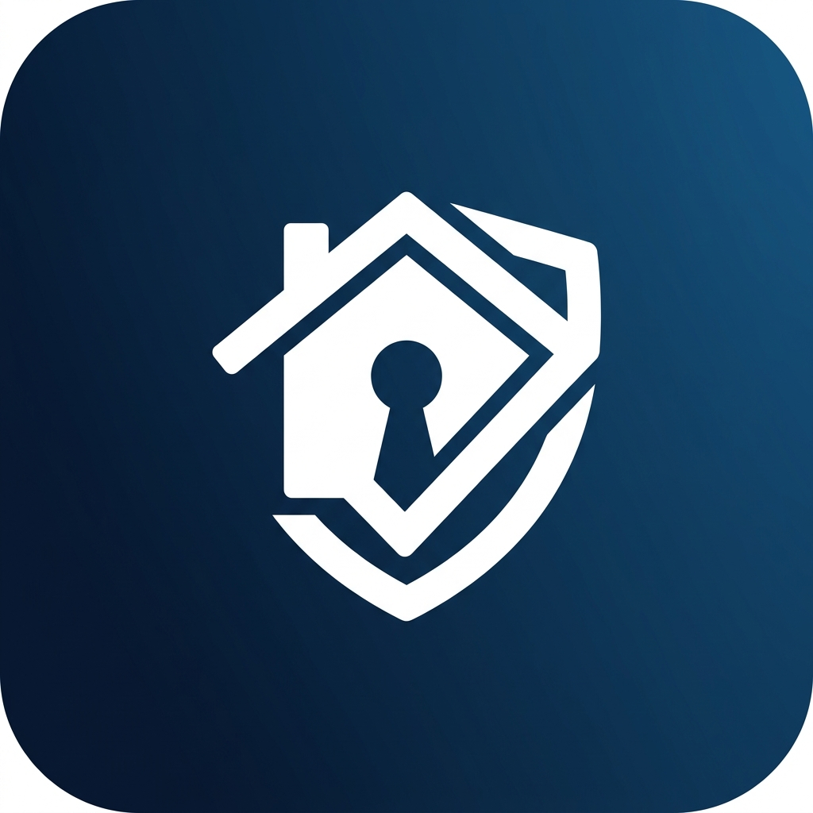

# HomeProof

  

HomeProof is a professional housing trust platform designed to help renters evaluate properties before signing a lease. By aggregating community intelligence, trust scores, and AI-assisted risk analysis, HomeProof provides unprecedented transparency into the rental market.

## Architecture

The platform follows a strict feature-first architecture, separating the client UI, business logic, API layer, and platform services. 

- **Mobile Client**: Built with React Native and Expo SDK 56.
- **Navigation**: Expo Router (File-based routing).
- **State Management**: Zustand for optimistic UI, TanStack Query for server state.
- **Styling**: NativeWind with Reanimated for 60FPS micro-interactions.
- **Backend API**: FastAPI (Python).
- **Asynchronous Tasks**: Celery and Redis.
- **Database & Auth**: Supabase (PostgreSQL, PostGIS, Storage, Edge Functions).

## Production Infrastructure

HomeProof is hardened for production deployment with the following systems integrated:

- **CI/CD Pipeline**: GitHub Actions workflows validate TypeScript and ESLint on every Pull Request.
- **Cloud Builds**: Configured for Expo Application Services (EAS) across Development, Preview, and Production profiles.
- **Observability**: Centralized logging facade integrated with Sentry for automatic error capture and crash reporting.
- **Offline Resilience**: Custom offline queue manager leveraging MMKV storage to cache user-generated reports without network access, automatically synchronizing when the device reconnects.
- **AI Fallbacks**: AI analysis tasks utilize exponential backoff and retry mechanisms to handle API rate limiting gracefully.

## Getting Started

### Prerequisites

- Node.js 18 or later
- npm or yarn
- Python 3.10 or later
- Docker (for local Redis/Supabase if required)
- Expo Go application on iOS/Android

### Installation

1. Clone the repository.
2. Navigate to the mobile application directory:
   `cd apps/mobile`
3. Install dependencies:
   `npm install`
4. Copy the environment variables:
   `cp .env.example .env`
5. Populate the `.env` file with your Supabase credentials and Sentry DSN.

### Running the Application

Start the Expo development server:

`npx expo start`

Scan the resulting QR code using the Expo Go app on your mobile device.

## Security & Compliance

HomeProof enforces strict Row Level Security (RLS) on all database interactions. The mobile client implements rigorous App Store privacy guidelines, providing explicit justification for location, camera, and photo library access. All user-uploaded media is subject to MIME type and size validation prior to cloud storage.

## License

All rights reserved.
